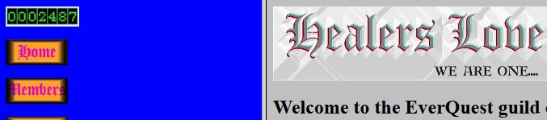
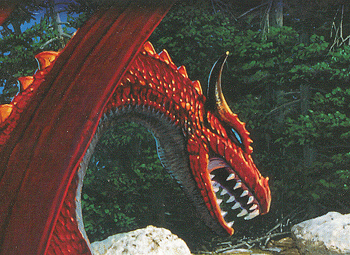
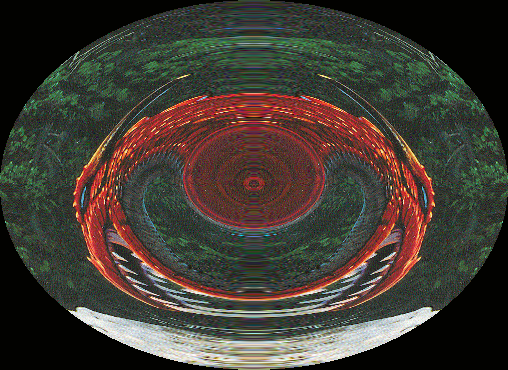
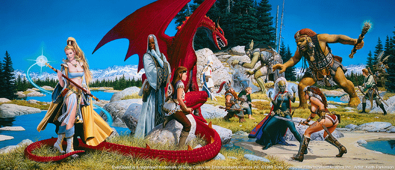
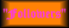
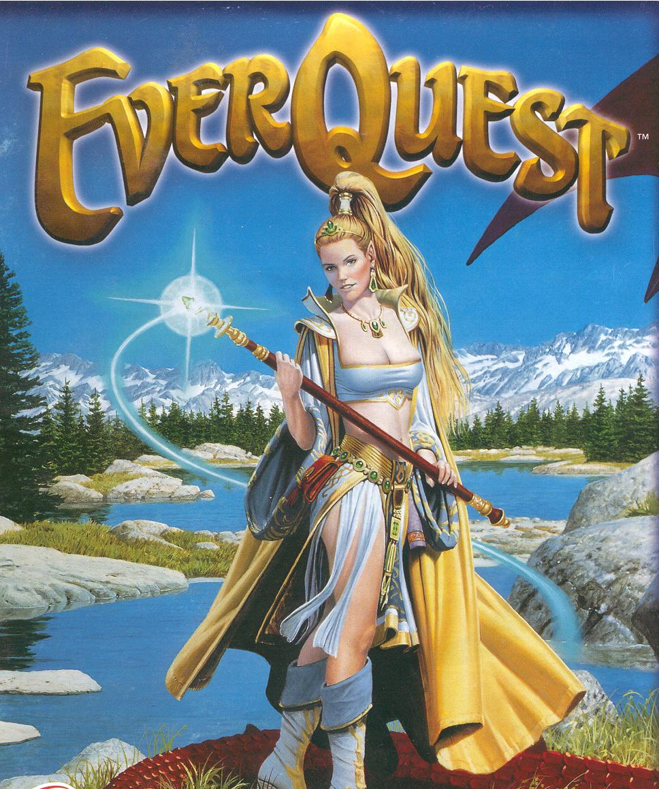
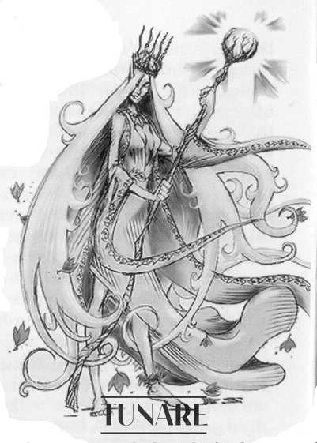

[![Contributors][contributors-shield]][contributors-url]
[![Forks][forks-shield]][forks-url]
[![Stargazers][stars-shield]][stars-url]
[![Issues][issues-shield]][issues-url]

<!-- PROJECT LOGO -->
 

  

<h3 align="center">The Healer's Love - Revive to Archive</h3>

  

    Back around 1999, I had this site I made with Dreamweaver and posted to Geocities for my EverQuest guild. Going through some old hard drives I found what was left of the site and decided I'd get it posted one last time, as close to the final vision that I had at the time.
     
     
       <a href="https://github.com/github_username/repo_name"><strong>View the site here »</strong></a>
  

<!-- TABLE OF CONTENTS -->

  
Table of Contents

  <ol>
    <li><a href="#about-the-project">About The Project</a></li>
    <li><a href="#changes-and-updates">Changes and Updates</a></li>
    <li><a href="#unused-assets">Unused Assets</a></li>
    <li><a href="#final-thoughts">Final Thoughts</a></li>
  </ol>

<!-- ABOUT THE PROJECT -->
## About The Project

 
I tried to preserve the best I could to keep all the source code the same, wrapped together with duct tape and lies. I had to make a few adjustments to make it a functional page, but everything should be mostly as ugly as it was. I had no idea CSS exsisted and used Dreamweaver with a bit of hand crafted HTML and I got this lovely site using frames, tables, and HTML styling. It had background music, a counter, and only thing missing was a webrring!

(<a href="#readme-top">back to top</a>)

<!-- CHANGES AND UPDATES -->
### Changes and Updates

I had to make a few changes to make sure it not only works as intended, but to make it as close to what my "finished" version at the time would have been:
- "Music": MIDI files no longer auto-play on repeat when a page loads, imagine that! I had to convert the MIDI to MP3, and it still sounds <em>similar</em>, but not the exact same. You have to manualy click the "Play" button to hear the music - which of course I recommend! The MIDI files are in the unused-assets folder.
- Counter: I just went with an image   as the UltimateCounter I used before is of course, defunct. There are modern ways to get a working counter, but it would be from 0 and views now, and kind of goes against the spirit of the project.
- Frames: There was a bug with the frames not targetting correctly, and I even mentioned it on the site! Today, it was creating a new tab for each click, now the frames properly target!

Besides all that, the original spirit is completely intact! It is essencially the vision I had at the time. I commented the code if I had to make a change or remove something to make it work - but enjoy, the code is a rough read!

(<a href="#readme-top">back to top</a>)

<!-- UNUSED ASSETS -->
## Unused Assets

I had several files that were in the folder (and possible on the server) that were never used, and I either had sitting waiting for inspiration or maybe had a plan that never happened! So I put them in a folder to be viewed, here is what each one is:

- <strong>5[1].mid</strong>: Old MIDI that was in the 2nd box before updated.
- <strong>9.mid</strong>: The MIDI file that is used on the site now that I had to convert to an MP3.
- 
- <strong>banner.bmp</strong>: Older logo.
- <strong>bomb.wav</strong>: Loved (and still do) Warcraft, this is the Paladin quote from Warcraft 2, "I am at your service".
- <strong>Chocobosong[1].mid</strong>: Loved (and still do) Final Fantasy, so from one of the games that came out from 1999 and before.
- 
- <strong>dragon.bmp</strong>: Might have been the image that took so long to load.
- 
- <strong>dragon2.bmp</strong>: Cool image I made with the dragon's head, but never had a purpose.
- 
- <strong>EQposter_800x344.gif</strong>: Poster from the game, I beleive this was the box art that when you opened the box this image continued on through. Great resource I pulled different parts from like the High Elf and Dragon's head.
- 
- <strong>Followers.gif</strong>: Navigation image for a "Followers" page I was going to make, but for some reason the image was ugly and has quotations on it, so instead of putting it together on site it goes here.
- <strong>followers.html</strong>: Started attempt when I as going to split the Members page up, or possibly, I combined the Members page and Followers page - will never know for sure!
- <strong>kelathin[1].mid</strong>: The MIDI of the music that was suppose to auto-play, from the first music box seclection in the navigation frame.
- 
- <strong>Lindsy.jpg</strong>: Front cover of box art, pretty cool, but never had a use for it.
- <strong>members.html</strong>: Like the Followers page, it is possible this was going to be split, or was split and merged.
- 
- <strong>Tunare.jpg</strong>: Pulled from the manual (that also gives a lot of story), she is <em>"The goddess of harmony is mother to elves and many woodland creatures across the face of Norrath."</em> So she fit the theme as the deity for healers, though the image was never used here.

(<a href="#readme-top">back to top</a>)

<!-- FINAL THOUGHTS -->
## Final Thoughts

I loved bringing this "back to life". Maybe one day for a project I'll completely re-write the code and make it totally fresh and use updated starndards with HTML and CSS... but no rush! Hope you enjoyed seeing a website built by teen me in the 90s!

(<a href="#readme-top">back to top</a>)
